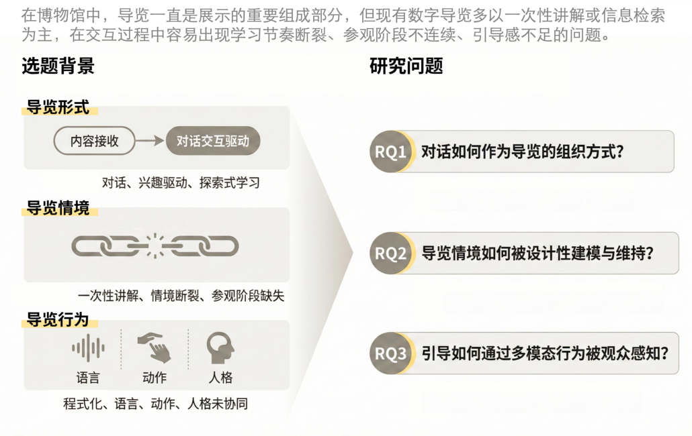
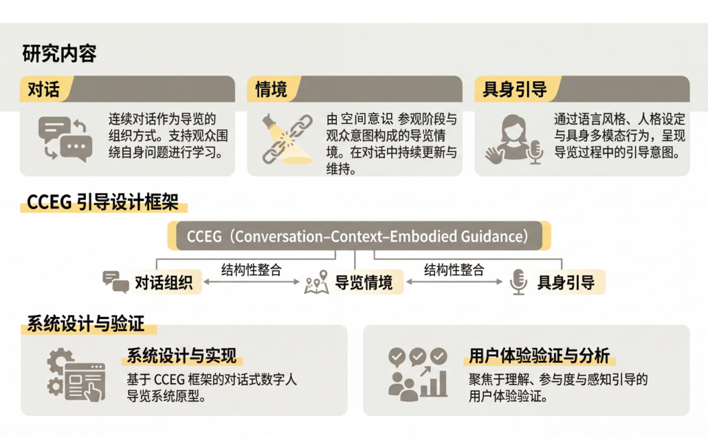
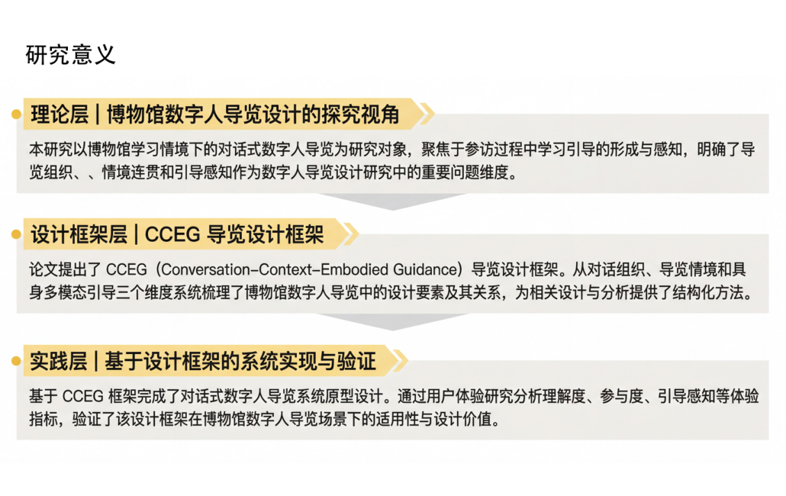
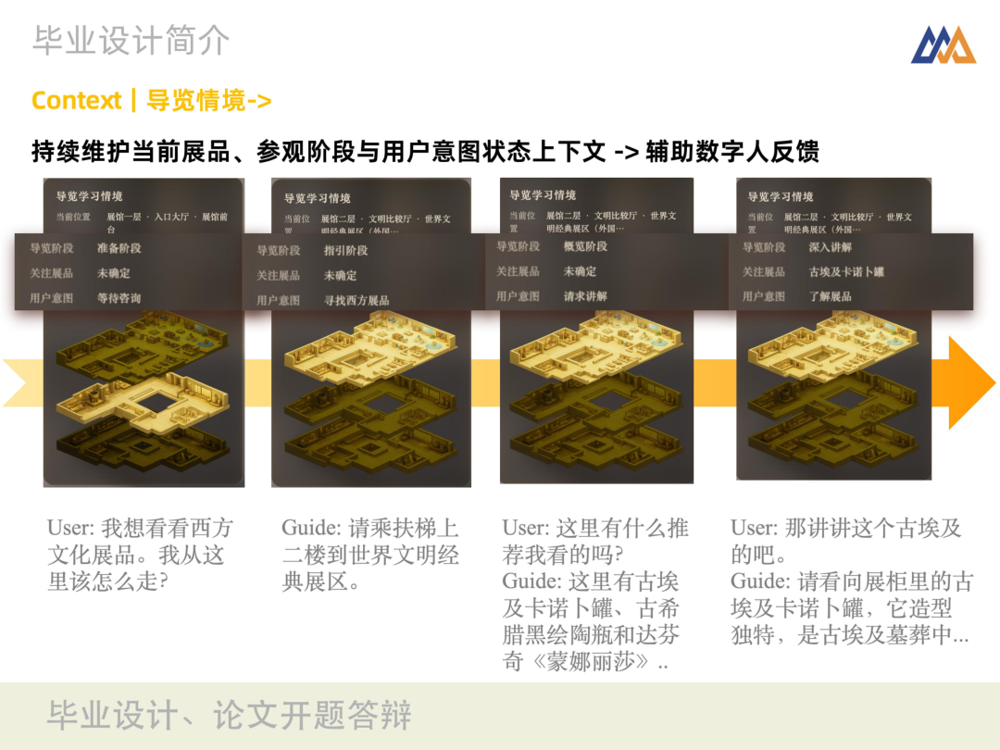
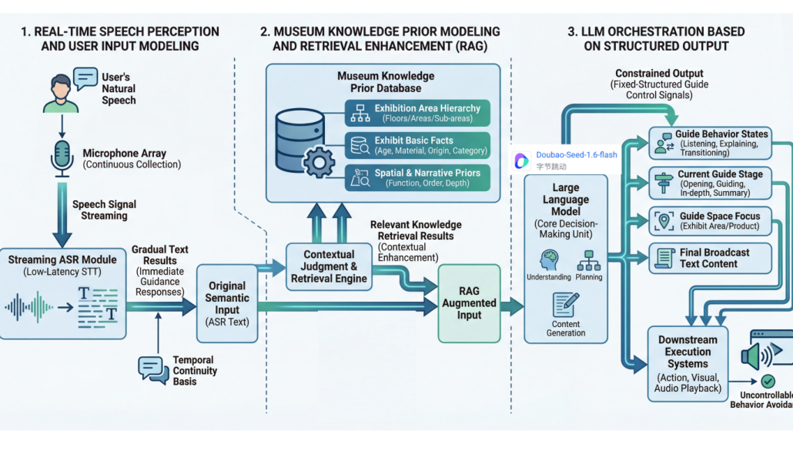

# MuseGuide - 面向博物馆学习场景的对话式具身数字人导览


<p align="center">
  <strong>Conversation × Context × Embodied Guidance</strong><br/>
</p>


<p align="center">
  
  
  
  
</p>

<p align="center">
  
</p>


## ✨ What Is MuseGuide

MuseGuide 是一个面向博物馆导览的对话式数字人系统原型。
它将导览过程拆成三条协同主线：

- **Conversation**：连续对话组织导览节奏
- **Context**：持续维护导览情境与空间线索
- **Embodied Guidance**：通过角色、语音与动作完成具身表达

> 核心目标：让导览从“一次性讲解”变成“可交互、可持续、可感知”的学习体验。

## 🧭 Thesis-Aligned Structure

### 1) 研究背景与问题



### 2) CCEG 设计框架



### 3) 论文主线与系统对应



## 🖥️ System Preview

### Prototype UI


### Conversation


### Context



### Embodied Guidance


### End-to-End Architecture



## 🚀 Quick Start（系统部署）

### Requirements

- Python 3.10+
- Node.js 18+

### Install

```bash
pip install fastapi uvicorn websockets pyyaml python-docx volcengine-sdk
cd frontend
npm install
```

### Configure

在 `museguide/configs/secrets.yaml` 中配置密钥：

- `doubao.api_key`
- `tts.*`
- `asr.*`

### Run Backend

```bash
./dev.sh
```

### Run Frontend

```bash
cd frontend
npm run dev
```

## 🧪 Current Scope

- 当前版本聚焦“博物馆导览”核心场景
- 强调原型验证与体验验证，不追求工程化完备
- 数字人表现以状态驱动为主，实时逐帧口型仍在后续方向中

## 🗺️ Roadmap

- [ ] 实时口型与视频驱动链路升级
- [ ] 更细粒度的导览情境建模
- [ ] 更系统的量化评估与对照实验
- [ ] 多语言导览体验优化

## 🤝 Contributing

欢迎 Issue / PR / 讨论建议。
如果你有博物馆教育、交互设计、语音交互或数字人方向的想法，欢迎一起共创。

## 📄 License

目前仓库暂未声明正式开源许可证。
如需对外开源发布，建议补充 `LICENSE` 文件（如 MIT / Apache-2.0）。

## 🙌 Acknowledgements

本 README 叙事结构与图示基于项目开题材料整理，并与当前原型实现保持一致。
