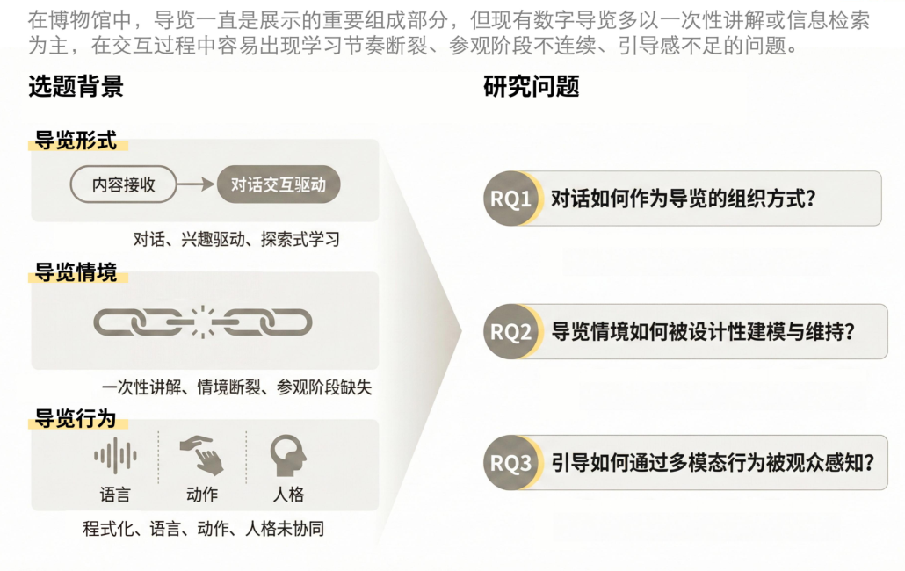
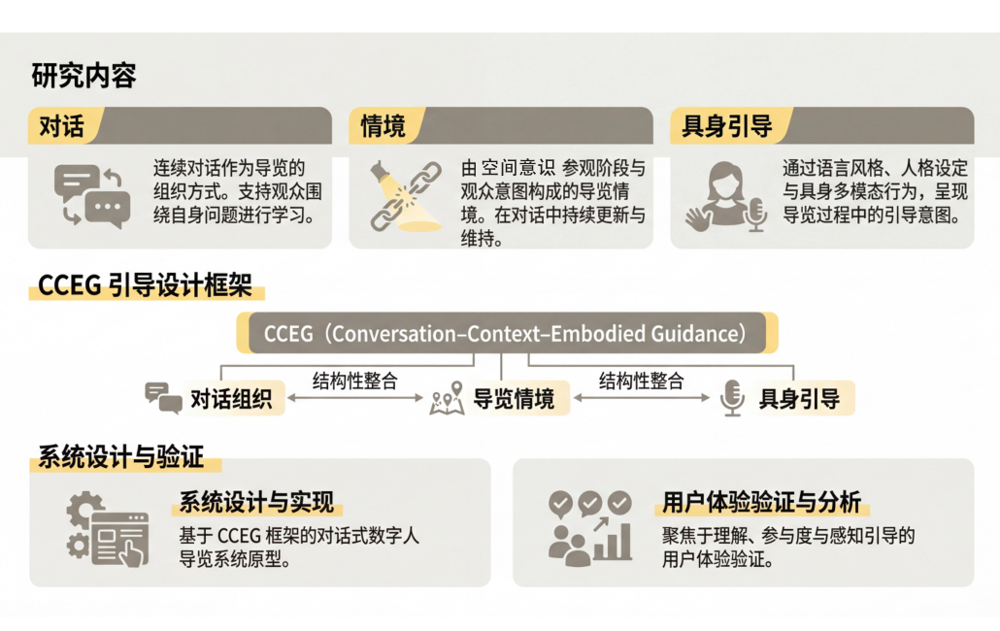
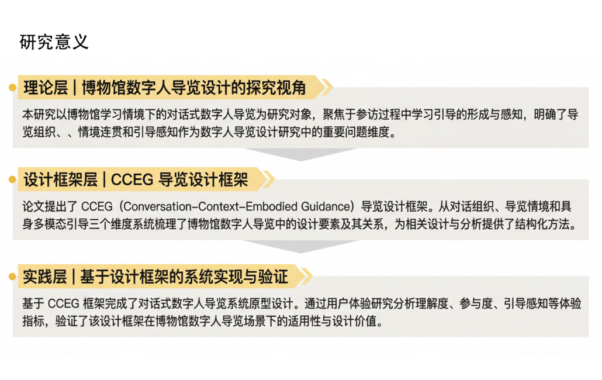
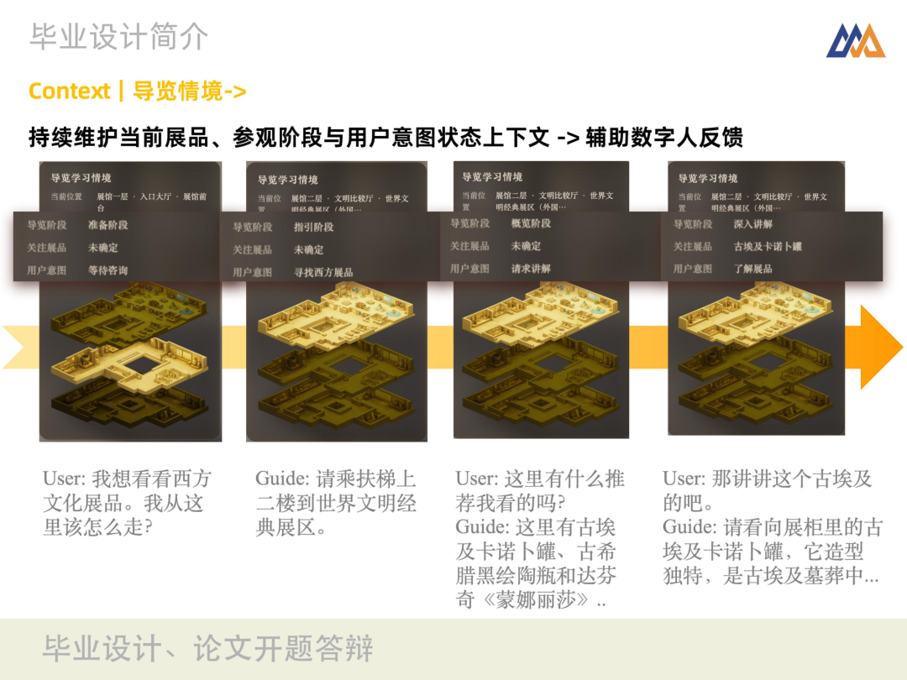
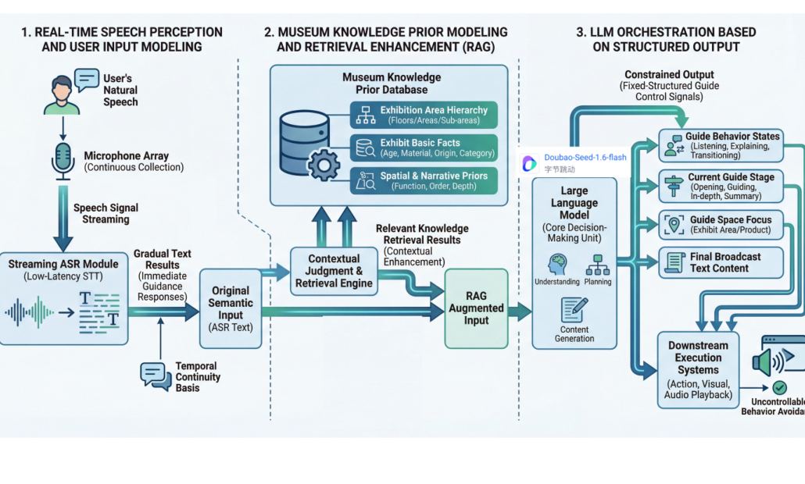

# MuseGuide - 面向博物馆学习场景的对话式具身数字人导览


<p align="center">
  <strong>Conversation × Context × Embodied Guidance</strong><br/>
</p>


<p align="center">
  
  
  
  
</p>

<p align="center">
  
</p>


## ✨ What Is MuseGuide

MuseGuide 是一个面向博物馆导览的对话式数字人系统原型。
它将导览过程拆成三条协同主线：

- **Conversation**：连续对话组织导览节奏
- **Context**：持续维护导览情境与空间线索
- **Embodied Guidance**：通过角色、语音与动作完成具身表达

> 核心目标：让导览从“一次性讲解”变成“可交互、可持续、可感知”的学习体验。

与普通“问一句答一句”的数字人相比，MuseGuide 额外维护了一套**导览情境**：

- 当前在哪个展厅、看过哪些展品、还有哪些没看
- 当前处于引路、展厅介绍、展品介绍、展品聚焦还是深入讲解
- 当前轮推荐了什么，用户说“好/是的”时应该顺着哪一步继续推进
- 当前导览阶段应该触发什么身体动作与视频状态

这使得系统更像“真的在带观众逛展”，而不只是一个会说话的数字人问答界面。

## 🧠 Current Capabilities

- **会话级导览情境维护**：后端持续维护当前展区、当前展品、已看/未看展区、已看/未看展品、导览阶段与用户兴趣。
- **主动导览推进**：每一轮都会根据导览进程生成推荐入口，而不是只被动回答问题。
- **确认式推进**：用户回复“好/是的/要/可以”等低信息确认时，系统会结合上一轮推荐动作继续推进。
- **展厅完成感知**：当前展厅全部讲完后，再说“下一件”，系统会转而引导去下一个展厅。
- **视频动作强映射**：视频状态不再主要依赖 LLM 自由输出，而是由导览阶段与导览事件确定性映射到问候、讲解、指路、聚焦等动作。
- **结构化推荐 chips**：开始导览、进入展厅、聚焦展品等阶段会返回不同的推荐入口，前端直接渲染为可点击操作。

## 🧭 Thesis-Aligned Structure

### 1) 研究背景与问题



### 2) CCEG 设计框架



### 3) 论文主线与系统对应



## 🖥️ System Preview

### Prototype UI


### Conversation


### Context



### Embodied Guidance


### End-to-End Architecture



## 🚀 Quick Start（系统部署）

### Requirements

- Python 3.10+
- Node.js 18+

### Install

```bash
pip install fastapi uvicorn websockets pyyaml python-docx volcengine-sdk
cd frontend
npm install
```

### Configure

在 `museguide/configs/secrets.yaml` 中配置密钥：

- `doubao.api_key`
- `tts.*`
- `asr.*`

### Run Backend

```bash
./dev.sh
```

该脚本会同时启动：

- ASR WebSocket：`9001`
- TTS Worker：`8765`
- API Server：`8000`

### Run Frontend

```bash
cd frontend
npm run dev
```

## 🏗️ Backend Pipeline

当前后端导览链路大致如下：

1. 用户输入进入 `LLMOrchestrator`
2. 后端读取会话级导览状态（展厅、展品、已看/未看、阶段、待确认推荐动作）
3. `prompt_builder` 组装导览情境 prompt
4. LLM 输出结构化 JSON
5. `response_parser` 做 JSON 容错与字段归一化
6. `tour_state_manager` 更新导览进程
7. `initiative` 生成下一步推荐入口
8. 后端根据导览阶段与事件强映射视频动作状态

对应核心模块：

- `museguide/llm/orchestrator.py`
- `museguide/llm/prompt_builder.py`
- `museguide/llm/response_parser.py`
- `museguide/llm/tour_state_manager.py`
- `museguide/llm/initiative.py`
- `museguide/llm/context_store.py`

## 🧪 Current Scope

- 当前版本聚焦“博物馆导览”核心场景
- 强调原型验证与体验验证，不追求工程化完备
- 数字人表现以状态驱动为主，实时逐帧口型仍在后续方向中

## 🗺️ Roadmap

- [ ] 实时口型与视频驱动链路升级
- [ ] 更细粒度的导览情境建模
- [ ] 更系统的量化评估与对照实验
- [ ] 多语言导览体验优化

## 🤝 Contributing

欢迎 Issue / PR / 讨论建议。
如果你有博物馆教育、交互设计、语音交互或数字人方向的想法，欢迎一起共创。

## 📄 License

目前仓库暂未声明正式开源许可证。
如需对外开源发布，建议补充 `LICENSE` 文件（如 MIT / Apache-2.0）。

## 🙌 Acknowledgements

本 README 叙事结构与图示基于项目开题材料整理，并与当前原型实现保持一致。
